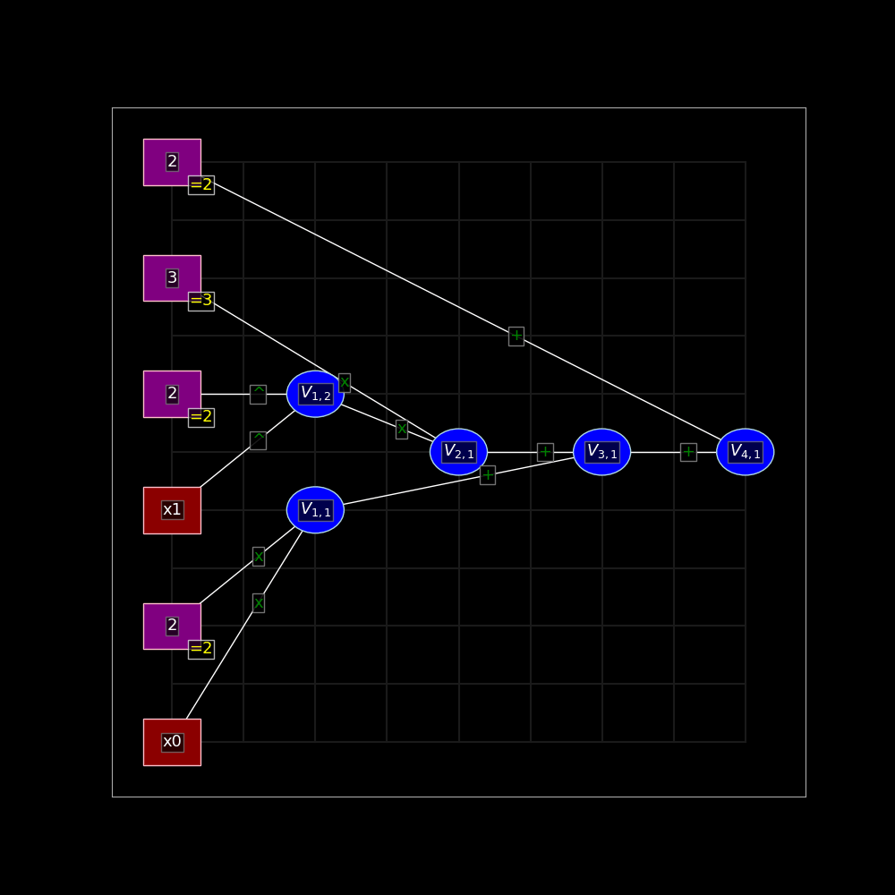
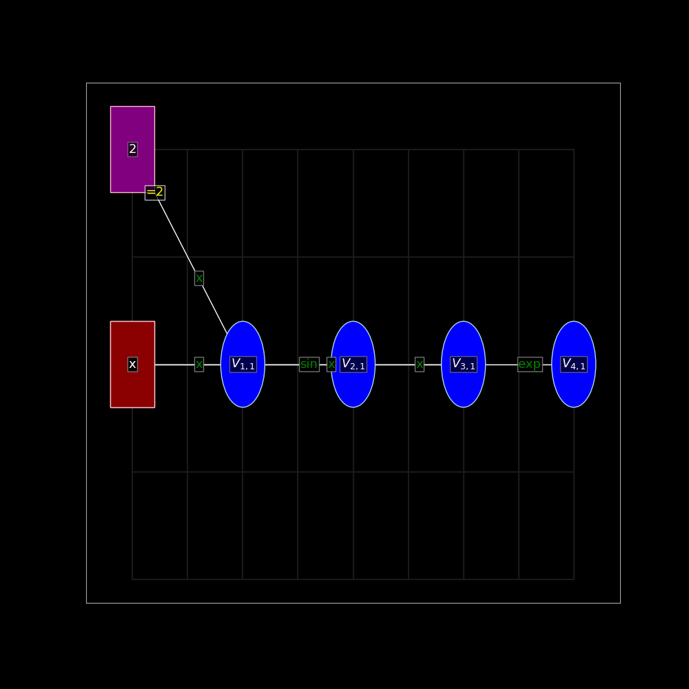
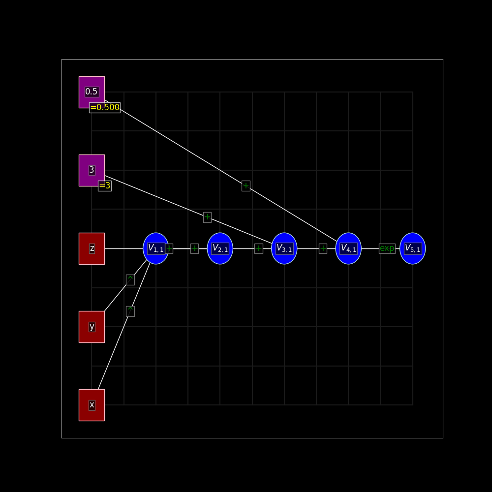

# Documentation
### AC 207 Fall 2021   

#### David Berthiaume
#### Lily Qian
#### Maggie Wu
#### Angel Hsu

## Introduction

Automatic differentiation, also known as algorithmic differentiation, involves efficiently and accurately evaluating derivatives of numeric functions from a computational perspective. In an era of rapidly advancing technology, automatic differentiation has many broad applications, especially in artificial intelligence, allowing many computations to be performed efficiently and greatly expanding the scope and coverage of artificial intelligence to widely different applications to enhance human lives. While artificial intelligence is certainly a widely known application of automatic differentiation with immense potential for further expanded applications, the significance of automatic differentiation also derives from its potential applications in computational fluid dynamics, atmospheric sciences, and engineering design and optimization.


This software package provides the following library:
 - autodiff: an easy-to-use library that performs automatic differentiation of one or several user supplied functions.  Both scalar and vector functions are supported.  This library is also able to create animated visuals of the forward computation graph, showing the computation of the function value and derivatives at each step along the binary tree. 

## Background

As opposed to other methods for computing derivatives in computer programs, such as manually calculating derivatives (and then hard-coding them), numerical differentiation (finite difference approximations), symbolic differentiation (expression manipulation in computer algebra systems), automatic differentiation presents an elegant solution to allow for accurate, efficient differentiation even when involving complex operations, which the aforementioned methods tend to handle less well.

To provide a brief mathematical background, automatic differentiation involves utilizing the chain rule repeatedly. This allows us to compute the derivative of a composite function. The specification of which is included below[1]:


Rather than producing an expression for a derivative, automatic differentiation obtains its numerical value and bypasses symbolic inefficiencies by leveraging intermediate variables present in the original function implementation.

There are two main versions of automatic differentiation: forward mode and reverse mode. In simple terms, forward mode applies the chain rule to basic operations in a forward primal trace, obtaining a derivative trace. Conversely, reverse mode does not compute derivatives simultaneously but requires two separate phases: forward and backward. During the forward phase, all intermediate variables are evaluated, and their values are stored in memory. Afterwards, during the backward phase, the derivatives are propagated backwards using the chain rule. This is also known as backpropagation.

In this project, we use forward mode. Forward mode is probably best understood through a concrete example.  Consider the following simple polynomial with two inputs x1, x2, and one output:

.

The animated computation graph for this polynomial looks like the following:  



This was rendered using our visualizer extension. Our visualizer extension visualizes the automatic differentiation process by constructing an animated forward computation graph. Users can view how their supplied functions are computed step by step from input values to the final output values in the GIF animation.     

To compute the derivative with respect to x0 and x1 we follow the computation graph and compute the intermediate derivatives along the way using the chain rule mentioned above.  The following table show how the derivates with respect to x0 and x1 evaluated at x0 = 2 and x1 = 3 are computed step by step.


In the 'Derivative' column, we are computing the derivative of the elementary operation in the 'Operation' column and then evaluating it at the given numeric values.  By repeating this along the computation graph, we end up with our final derivatives.  Our library for this project uses this same approach.

 

## How to use autodiff

A user will interact with the automatic differentiation functionality through the autodiff module. This module uses automatic differentiation to calculate the Jacobian of a user supplied function. 

### Installation

To install the packages, you can either use PyPI or git clone and then the supplied setup.py file.

Use PyPI to install the packages:

`pip install autodiffvis-teapeople`

Use git clone to download the package:

`git clone https://github.com/cs107-theteapeople/cs107-FinalProject`

Once you have cloned the code, navigate to the root directory of the repository.  In the above example, this would be `cs107-FinalProject`.  

Once there, the software can be installed with

`python setup.py install`

The library requirement for our project are numpy(>=1.20.3), matplotlib(>=3.4.3), and imageio(>=2.9.0). All of these dependencies are automatically installed when autodiff is installed.  

If desired, these can be separately installed with pip using the supplied requirements.txt file
with the following command. 

`pip install -r requirements.txt`


### Testing and development

If you would like to run the tests (with coverage) and also make modifications to the code, the following approach can be used.

`python setup.py develop`

`pip install pytest`

`pip install pytest-cov`

`pytest --cov=autodiff`

### User guide

`import autodiff as ad`

The general structure of usage follows:
1. A user will instantiate scalar variables using the autodiff module 
2. A user will define a function by combining variables, constants, and primitive functions through various operations using the autodiff module.  Vector functions can be defined by using lists of scalar functions.
3. The function value and derivatives will be calculated and returned for specific input values using the `evaluate` function.  
 
The following is an example for single function input:

Instantiate a scalar variable:

`x = ad.var(‘x’)`

Set a user-defined composite function by combining elementary functions available in the autodiff module:

`f = ad.exp(ad.sin(x + 3 * x**2) * ad.cos(x))`

Evaluate the function and derivative at multiple points:

```
import numpy as np
for i in np.linspace(1,3,10):
    print(f.evaluate(x=i))
```

This will return both the value and the derivative of this function with respect to x evaluated at the given points as a dictionary.  For example each call to f.evaluate returns a dictionary that looks like the following:

`{'value': -3.027209981231713, 'derivative': -3.3713769787623757}`

The following is an example for vector inputs:

Instantiate scalar variables:

`x = ad.var('x')`

`y = ad.var('y')`

Set user-defined composite functions that have vector valued outputs:

`f = [x*y, x+y, y+y, ad.cos(y-x), ad.arctan(x), ad.logistic(x+y*2)]`

Evaluate the function and derivative with respect to x:
  
```
ad.evaluate(f, x =.2, y =.1, wrt = [x])
```

This will return both the value and the derivative of this function with respect to x evaluated at the given points as a list of dictionaries. 

`[{'value': 0.020000000000000004, 'derivative': {'x': 0.1}},`

`{'value': 0.30000000000000004, 'derivative': {'x': 1}},`

`{'value': 0.2, 'derivative': {}}, `

`{'value': 0.9950041652780258, 'derivative': {'x': -0.09983341664682815}},` 

`{'value': 0.19739555984988078, 'derivative': {'x': 0.9615384615384615}},` 

`{'value': 0.598687660112452, 'derivative': {'x': 0.24026074574152917}}]`

Note the use of the `wrt` parameter argument.  This can be used to limit which derivatives are returned.  If this is not
specified, all derivatives are returned for the function.  In this example above, it would return the derivative with respect to both x and y.

### Advanced usage - seed dictionary

A custom seed dictionary can be supplied to the evaluate method instead of supplying variables to the wrt argument.  The following examples show how to use this functionality.

```
x = ad.var('x')
y = ad.var('y')
f = ad.cos(x) + ad.sin(y)
f.evaluate(x=.1, y=.1, seed_dict={'x':1, 'y':1})
f.evaluate(x=.1, y=.1, seed_dict={'x':0, 'y':1})
```

By default, if a seed value isn't supplied for a variable, it is set to 1 in that pass, meaning that the normal derivative is calculated for that variable. Note that each derivative is computed individually, and this seed dictionary applies a scale to that derivative.  For example, using a seed dictionary of `{'x':1, 'y':1}` will compute the derivatives as normal, but using a seed dictionary of `{'x':1, 'y':0}` will set the y derivative to 0.  This is very different from the seed **vector** used in class. Also, unlike the `wrt` argument, this will set the derivatives to 0 and still return them.  The `wrt` argument is used to only return a subset of the derivatives. 

### How to use the forward computation visualizer

The visualizer package comes along with the autodiff package when installing. It is located in the same folder as the autodiff package. It is imported into the autodiff package and is used as part of the autodiff module. Hence, when you import autodiff module, the visualizer package will be automatically imported. 

Below is an example of using visualizer for a scalar-input function:

Instantiate a scalar variable:

```
x = ad.var('x')
```
Set a user-defined function that has scalar valued outputs:

```
f = ad.exp(x*ad.sin(2*x))
```

Generate the animated visualization of the function evaluation processes:

```
print(f.evaluate(x=1, plot='<filepath>/animate_demo_scalar.gif'))
```

The animate_demo_scalar.gif file will be stored at the filepath the user specified in the plot argument.



Below is an example of using visualizer for a function with multiple input variables. 

Instantiate scalar variables:

```
x = ad.var('x')
y = ad.var('y')
z = ad.var('z')
```

Set the user-defined composite function

`f = ad.exp(x ** y + z + 3 + 0.5)`

Generate the animated visualization of the function evaluation processes with respect to x,y,z evaluated at x=1, y=1, and z=2:

```
f.evaluate(x=1, y=1, z=2, plot='<filepath>/animate_demo_scalar.gif')
```

The animate_demo.gif file will be stored at the filepath the user specified in the plot argument.



The user is able to see the forward mode evaluation process, with values and traces of derivatives being displayed at each step. 


## Software organization
#### Summary

For our code structure, we follow some of the suggestions outlined in class. It was suggested to not place our tests within our source modules.  For this project, we follow this approach.

Our project directory structure is in the following form:  


#### What modules do we have?

We include two modules.  

The first module, autodiff, will contain the functionality to perform automated differentiation.  

The second module, visualizer, is a visualization system that animates the automated differentiation process and draws the forward mode graphs.

#### Where do our test suite live?

Per the recommendations from class, our test suites (using pytest) live within a tests directory. We use pytest for our testing and codecov to monitor our code coverage.  Since Travis CI is no longer free, we set up a workflow to update codecov automatically via Github Actions instead of going through Travis CI.

To run the test suite, pytest must be installed.

`pip install pytest`

Once pytest is installed, within the root directory of the repository one can run the test suite with,

`pytest`

#### How will you distribute your package (e.g. PyPI)?

We host our project on PyPI and allow users to install the software with pip. The package name is `autodiffvis-teapeople`.

## Implementation 
### Introduction

A critical component of the **autodiff** module is the ability to define functions and input variables.  We use a model similar to sympy.  As mentioned in the ‘how to use autodiff’ section of this document, elementary functions are defined in the autodiff module and these can be combined to make composite functions.  We make heavy use of operator overloading to allow users to conveniently define their composite functions.  Elementary functions are Python functions within the autodiff module that generate simple intermediate node instances as described below.  

Our autodiff library uses lazy evaluation.  The binary tree of nodes is built first and possible values are represented by variable nodes.  Once a binary tree is created when the function is defined, the tree can be traversed in postorder and the value of the function and the derivative of the function computed by using the `evaluate` function as described in the *how to use* section.  In this way, a single function can be defined, and then efficiently evaluated at any number of inputs.  In particular, this approach is useful for a root finding method like Netwon's method.

### Node class

Our main class for building composite functions is the autodiff node class.  There are three types of nodes.  

1. A variable node - this node contains a symbolic representation of a numeric value.   It is a leaf node in the binary tree corresponding to a composite function.
2. A constant node - this node contains a specific numeric value that does not change.  Just like the variable node, it is a leaf node in our binary tree.
3. An intermediate node - these are all non-leaf nodes and have unary or binary functions attached to them.  These intermediate nodes are traversed during forward computation, the functions are applied and the derivatives are computed using the chain rule.  

Nodes use operator overloading heavily to allow the user to build up composite functions.  The forward computation graph is generated as the composite function is built (taking advantage of the Python parser and order of operations).  The utility function `ad.var(<name>)`, is used to build a single variable node.  These variables nodes have names associated with them.  Composite functions are built by combining these variables with operators and primitive functions (created using helper closures in the autodiff module), and constants. 

Here are some example ways for a user to define a composite function (an instance of the Node class with children, or a list of instances).  

```
import autodiff as ad
x1 = ad.var('x1')
x2 = ad.var('x2')
func1 = x1 + x2
func2 = ad.cos( x1 * x2 ) 
func3 = ad.sin( x1 ) + ad.cos( x2 ) * 4.0 
func4 = x1 ** 6  (operator overloading allows us to handle raising powers to reals or integers)
func5 = [x1 * x2, x1 + x2] (functions with multiple outputs can be defined through lists)
func6 = x1 ** (ad.cos(x1) + 2 * x1) + 42
```

### Evaluation

Once a composite function is defined, the `evaluate` function can be called to evaluate the function and compute the derivative of the function at the specified inputs efficiently.

Inputs are entered as keyword arguments or a dictionary.  We match these inputs with the expected variables from the composite function corresponding to the Node.  If there is a mismatch in variables and expected inputs, we raise an appropriate error.  Only numeric inputs are allowed.

Once this function is called, the computation graph (created during function object instantiation) is used to evaluate the function at the supplied points, and then compute the derivative at these points using forward mode automatic differentiation.  As we perform the forward and tangent traces, we store these intermediate results within all the nodes of the binary tree.

For functions with multiple inputs and/or outputs, we allow users to specify which derivatives they would like to compute through the `wrt` argument.  By default, we compute all derivatives and return the Jacobian.  

### Adding new functions

We have written a closure `get_function` that allows one to very easily add elementary functions to our autodiff library.  This closure returns a function that handles inserting the necessary nodes into the binary tree, defining the right types of node to insert, establishing the appropriate child nodes, and storing the primary and tangent functions.  

The following is an example of using this closure to create the *tan* function.

```
tan = ad.get_function(np.tan, lambda x,xp : xp * (1/np.cos(x))**2)
```

This closure takes two arguments.  The first one defines the function to evaluate and the second one defines the derivative of that function (using the chain rule).  In this example, the function 
`lambda x,xp : xp * (1/np.cos(x))**2` is inlined as a lambda function, but this could also easily have been a regular python function.  

Our primary function expects one or two arguments corresponding to the values of the inputs depending on if the function is unary (sin, cos, etc.) `x`, or binary (addition, multiplication, division, etc.) `x` and `y`.  The derivative function expects 4 arguments. These are the values of the inputs `x`, and `y` and the derivatives of the inputs `xp`, and `yp`. 

Our module supports vector valued output functions, and thus our primary function can take in multiple composite functions and output their values and derivatives respectively. 

The following built-in list of elementary functions are available in autodiff:

 - sin (inputs are in radians)
 - cos 
 - exp 
 - tan
 - log (logarithm to any base.  The second argument is the base)
 - ln (natural log)
 - arcsin 
 - arccos 
 - arctan 
 - sinh 
 - cosh 
 - tanh 
 - logistic
 - sqrt
 - multiplication (x)
 - division (+)
 - subtraction (-)
 - power (^)
 - negation (-)
 - less than (<)
 - greater than (>)
 - less than or equals (<=)
 - greater than or equals (>=)

### External dependencies

External dependencies include numpy(>=1.20.3), matplotlib(>=3.4.3), and imageio(>=2.9.0). The latter two libraries are used to plot and view the computation graphs. For efficient computation, we rely heavily on numpy to carry out the elementary function operations within each defined elementary function in autodiff. For example, for the primal trace and its corresponding tangent trace for ad.sin(), we use np.sin() and np.cos() to carry out the operations respectively. 

## Extension
### Visualization tool

Our visualizer tool generates animated graphs of the forward mode binary tree and displays values and derivative traces as they are evaluated step by step. It is a very useful illustration of the inner workings of automatic differentiation as it is being applied.

To generate an animated plot of the computation graph, one can use the `plot` argument of the evaluate function.  For example:

```
x = ad.var('x')
y = ad.var('y')
f = ad.exp(x ** y + z + 3 + 0.5)
f.evaluate(x=1, plot='<filepath>/animate_demo_scalar.gif')
```

This will generate a plot and save it to the specified file.

### How it was made

Internally we use matplotlib to render our animations using low level primitives such as line segments, elipses, rectangles, and text.  Matplotlib performs antialiasing when rendering these primitives.  A custom node placement engine was created to arrange the nodes in a readable left to right format, similar to how one would read text (in English).  The left to right ordering of the nodes is based on the maximum distance between the node and any of its input variables or constants.

After placement of the nodes, we generate edges of the graph by traversing the binary tree and creating line segments to the left and right children (if they exist) of each of these visited nodes.  These are internally stored for later animation.  

As the computation graph is traversed, the nodes are highlighted in the binary tree and animations are applied to show the computations being applied in postorder.  We show the intermediate values and derivatives as they are computed at each step. All of the intermediate function values and derivatives are stored at each node, and these values are rendered at each node in the computation graph.

We store a list of rendered frames internally in memory to create the animation and then use ImageIO to save the final set of frames to an animated GIF file. By repeating frames as needed in memory, we are able to pause the video at select locations such as the end of each intermediate step, and the end of the final computation step.

## License:

After much consideration, we have settled on using the gnu GPLv3 license as it has allows one to do almost anything they want with the code **except** distributing closed-source versions.  Given the academic nature of this project, we feel it is best that close-source versions are not allowed.  The main purpose of this code is for people to learn from it, and we feel that having the freedom to view and modify code is a critical part of this.  

## Broader impact and inclusivity statement

### Broader impact

As one of the fundamental algorithms, automatic differentiation is used extensively across almost every area in science fields, ranging from physics, biology, genetics, applied mathematics, optimization, statistics, machine learning, and health science. Our goal with this software is to provide an automatic differentiation library that is easy to understand, read, and modify. We wish that our software can serve both an educational purpose and also be of practical use. We wish that through reading our code, using our software and plotting animated visualizations, potential users can understand the forward mode automatic differentiation thoroughly, and hence can better apply this algorithm in their own disciplines.

### Inclusivity statement

Tea-people encourage users to modify the code and experiment with various techniques. We include elaborate documentation and detailed user guide so that users new to this package will not have a difficult time navigating the functionality of our package. As we are developing this package, the pull requests are reviewed and approved by every member of our team. We also welcome users to make pull requests and provide recommendations in every aspect of this software, from implementation, code efficiency, software organization, to additional features that would be great to include. Despite this package is written in English, we are still eager to hear different opinions from users in our diverse coding community. 

## Future
There several future features on our list which we would like to implement in the future.

1. Support for arrays of variables. Even with vector functions supported, variables will need to be defined individually, i.e. `x1, x2, x3 = var('x1'), var('x2'), var('x3')...` This is quite cumbersome. We would like to add support for vectors of variables in the following manner. `x_array = var_array('x', 100)` which will generate an array of 100 variables. These can be referenced by using indices, `x[4]` to reference the 5th variable (indexing starts at 0). Some applications of this include defining recursive functions, and working with finite series.

2. We would like to implement a root finding algorithm using Newton's method. A function can be defined using the autodiff library, and then newton's method will solve for the roots of the given function. This will be iteratively using autodiff to efficiently compute derivatives. The lazy evaluation approach of our library lends itself quite well to a Newton solver, where the same equation (and its derivative) is evaluated over and over again.

3. We would like to incorporate customizable features into our visualizer. Users will be able to adjust the colors, text, figure size, and animation speed in the visualizer. This can help them present a more appealing visualization to their audience based on their needs.  

## References:

1. Lange, R. (2019, September 2). Forward mode automatic differentiation &amp; dual numbers. Medium. Retrieved October 20, 2021, from https://towardsdatascience.com/forward-mode-automatic-differentiation-dual-numbers-8f47351064bf. 

2. Lindsey Brown, Rachel Moon, and David Sondak IACS Harvard, https://autoed.herokuapp.com/

3. Jp Calderone, 16:58:00, 2007-12-21, Filesystem structure of a python project. jcalderone. Retrieved October 20, 2021, from https://jcalderone.livejournal.com/39794.html. 

4. Good Integration Practices - pytest documentation. (n.d.). Retrieved October 20, 2021, from https://docs.pytest.org/en/6.2.x/goodpractices.html. 

