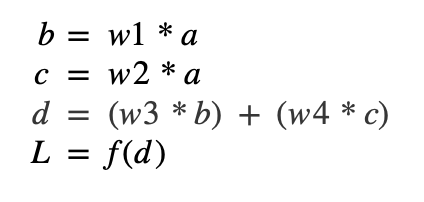
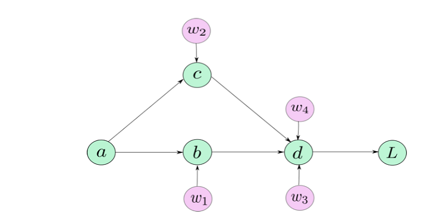
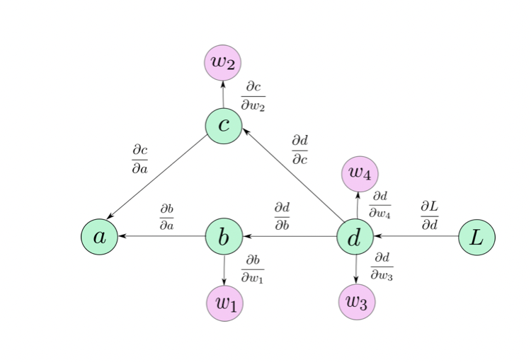

# Milestone 1
### AC207 Fall 2021

#### David Berthiaume
#### Lily Qian
#### Maggie Wu
#### Angel Hsu

## Introduction


Automatic differentiation, also known as algorithmic differentiation, involves efficiently and accurately evaluating derivatives of numeric functions from a computational perspective. In an era of rapidly advancing technology, automatic differentiation has many broad applications, especially in artificial intelligence, allowing many computations to be performed efficiently, greatly expanding the scope and coverage of artificial intelligence to widely different applications to enhance human lives. While artificial intelligence is certainly a widely known application of automatic differentiation with immense potential for further expanded applications, the significance of automatic differentiation also derives from its potential applications in computational fluid dynamics, atmospheric sciences, and engineering design and optimization.

Root finding is an algorithm used to find the zeroes or roots of a continuous function.  Often, solving for the roots of a function analytically is not possible (except in simple cases such as lower degree polynomials).  Iterative methods are used instead.  One highly efficient method is Newton’s method which requires exact forms or approximations of the derivative of the function.

This software package provides two libraries:
1. Autodiff provides an easy-to-use library that performs automatic differentiation of a user supplied function.
2. Rootfinder uses autodiff to find the roots for continuous functions.

## Background

As opposed to other methods for computing derivatives in computer programs, such as manually calculating derivatives (and then coding them), numerical differentiation (finite difference approximations), symbolic differentiation (expression manipulation in computer algebra systems), automatic differentiation presents an elegant solution to allow for accurate, efficient differentiation even when involving complex operations, which the aforementioned methods tend to handle less well.

To provide a brief mathematical background, automatic differentiation involves utilizing the chain rule repeatedly. This allows us to compute the derivative of a composite function. The specification of which is included below:


Rather than producing an expression for a derivative, automatic differentiation obtains its numerical value and bypasses symbolic inefficiencies by leveraging intermediate variables present in the original function implementation.

There are two main versions of automatic differentiation: forward mode and reverse mode. In simple terms, forward mode applies the chain rule to basic operations in a forward primal trace, obtaining a derivative trace. Conversely, reverse mode does not compute derivatives simultaneously but requires two separate phases: forward and backward. During the forward phase, all intermediate variables are evaluated, and their values are stored in memory. Afterwards, during the backward phase, the derivatives are propagated backwards using the chain rule. This is also known as backpropagation.

In a simple example model where$^1$:
 


The graph structure of calculations, or the computation graph, would look like the below$^2$: 



In applying the chain rule to our computation graph, we obtain the following:




## How to Use Autodiff

A user will interact with the automatic differentiation functionality through the autodiff module.  This module uses the automatic differentiation algorithm to calculate the Jacobian of a user supplied function. 

We will enable users to be able to install the package directly from the repository using pip. For example:

```
pip install git+https://github.com/cs107-theteapeople/autodiff.git
```

Or you can use git clone to install the package:

```
git clone https://github.com/cs107-theteapeople/autodiff.git 
```

The general structure of usage will be as follows:

* A user will define a function by combining variables, constants, and primitive functions through various operations.  
* A user will instantiate an AutoDiff object with the supplied function.
* The differentiate member function of the AutoDiff object will then be used to calculate the desired derivatives for specific input points.

It is important to note that the details of our implementation and usage patterns may change as we progress further into the project.

Here is an example basic usage for the autodiff module.

```
import autodiff as ad
```
Set user-defined function:
```
func = ad.const (0.4) * ad.sin( ad.var(x) * ad.var(y) )
```

For higher dimensional functions where named variables will become unwieldy, we will supply methods to allow a user to conveniently create and supply arrays of input variables.
  
Instantiate the object:
```
ad1 = ad.AutoDiff(func)
```
Evaluate the derivative:
```
ad1.differentiate(x = 2, y = 3)
```

This will return the derivate of this function with respect to x and with respect to y.


## How to Use Rootfinder

The rootfinder module can be used to find the roots of a supplied function defined through the autodiff module.  

Example use case:

```
import autodiff as ad
import rootfinder as rf
```

Create our function:
```
func = ad.sin( ad.var(x) ) * ad.cos( ad.var(x)**2 + 1.2)
```

Find the roots of our function:
```
rf.findroots(func)
```

This will return the roots of the supplied function using Newton’s method.

## Software Organization
#### Summary

For our code structure, we follow the recommendations from the blog post by Jp Calderone found at https://jcalderone.livejournal.com/39794.html to structure a python project.  He recommends not using a ‘src’ directory, and placing tests within each module along with an appropriate __init__.py file.  Similarly, we also follow the second recommendations provided by https://docs.pytest.org/en/stable/goodpractices.html to place the tests within each module (in a ‘test’ subdirectory).  This structure is useful if we have a direct relation between tests and application modules and want to distribute them along with your application.

Our project directory structure will be of the following form:  


#### What modules do you plan on including? What is their basic functionality?

We will include two modules.  

The first module, autodiff, will contain the functionality to perform automated differentiation.  

The second module, rootfinder, is an application that uses autodiff to find the roots of a function using Newton’s method.  Here being able to find the derivative of a function via autodiff is needed to use Newton’s method.

#### Where will our test suite live?

Per the recommendations above, our test suites (using pytest) will live within each module, autodiff, and rootfinder.  We will be using travis ci and codecov to monitor our test statuses and codecov to monitor our test coverage.

#### How will you distribute your package (e.g. PyPI)?
Using Pip’s version control support, we will provide the ability to install the software directly through the git repository.  Instructions to do so will be provided in the documentation and the root readme file.

#### How will you package your software? Will you use a framework? If so, which one and why? If not, why not?

Our project will only consist of python sources and a few common dependencies.  We will have no compiler requirements or binary files.  We will be using a source distribution for our project.  We will be using sdist to do this.

#### Other considerations?

Since we will be developing an application for our extension, we will speak with the teaching staff about our proposed structure. Our initial structure will have autodiff and rootfinder as two separate modules within the same repository root directory.  


## Implementation 
### Module methods

A critical component of the **autodiff** module is the ability to define functions and input variables.  We use a model similar to sympy.  As mentioned in the ‘how to use autodiff’ section of this document, variables, constants, and elementary functions will be defined in the autodiff module and these can be combined to make more complex functions.  We make heavy use of operator overloading and implicit conversions to allow users to conveniently define their functions.  

Here are some example ways for a user to define a function object.  

```
import autodiff as ad
x1 = ad.var(‘x1’)
x2 = ad.var(‘x2’)
func1 = x1 + x2
func2 = ad.cos( x1 * x2 ) 
func3 = ad.sin( x1) + ad.cos(x2) * 4.0   (* 4.0 uses an implicit cast from python literal to autodiff constant object for convenience)
func4 = x1 ** 6  (operator overloading allows us to convert the 6 to a autodiff constant)
func5 = [x1 * x2, x1 + x2] Functions with multiple outputs can be defined through lists.
```

### AutoDiff class

Once functions are defined, an AutoDiff object can be instantiated to evaluate the function for various inputs and then compute the derivatives.  

```
adiff = ad.AutoDiff( func2 )
```
where func2 is an autodiff function or a list of autodiff functions (for functions that have multiple outputs).  This class automatically determines the inputs and the number of outputs from the function definition.  This is used for validation when a user requests the function to be evaluated for the derivatives to be computed.  

Once this object is instantiated, a computation graph is created and stored as a dictionary of variables, elementary functions, and pointers to children.   This graph is traversed when the derivative is calculated.

For this project, a core data structure that we will use is dictionaries both the store our variables (with our keys being the names of the variables) and to store our computation graph.  Even though dictionaries are not the most efficient way to store this data, we would like to focus on readability, software design, code readability, maintainability, and learning over efficiency for this project.

This class provides one key method to calculate derivatives.  

```
adiff.differentiate( x1 = 4.0, x2 = 2.0 )
```

Inputs are entered as keyword arguments or a dictionary.  We match these inputs with the expected variables from the function that was used when instantiating the object.  If there is a mismatch in variables and expected inputs, we raise an appropriate error.  

Once this is called, the computation graph (created on object instantiation) is used to evaluate the function at the supplied points, and then compute the derivate at these points using forward mode automatic differentiation.  We do not plan on using dual numbers for this project as we feel that doing so will potentially reduce code readability and understanding.  As we perform the forward and tangent traces, we will be storing these intermediate results in a list of lists.

For functions with multiple inputs and outputs, we will allow users to specify which derivatives they would like to compute.  By default, we will compute all derivatives and return the Jacobian.  

### External Dependencies

We would borrow from external dependencies such as numpy and potentially a graph plotting library for viewing the computatiion graphs. For efficient computation, we will be relying heavily on numpy to carry out the elementary function operations within each defined elementary function in autodiff; for example, for the primal trace  and its corresponding tangent trace , we would use np.sin() and np.cos() to carry out the operations respectively.  For efficiency we may consider using the numba library for some of our core algorithms if this doesn’t reduce code readability and understanding.

## License:

After much consideration, we have settled on using the gnu GPLv3 license as it has allows one to do almost anything they want with the code **except** distributing closed-source versions.  Given the academic nature of this project, we feel it is best that close-source versions are not allowed.  The main purpose of this code is for people to learn from it, and we feel that having the freedom to view and modify code is a critical part of this.  

## Reference:

1. Lange, R. (2019, September 2). Forward mode automatic differentiation &amp; dual numbers. Medium. Retrieved October 20, 2021, from https://towardsdatascience.com/forward-mode-automatic-differentiation-dual-numbers-8f47351064bf. 

2. Kathuria, A. (2019, June 3). Getting started with Pytorch Part 1: Understanding how automatic differentiation works. Medium. Retrieved October 20, 2021, from https://towardsdatascience.com/getting-started-with-pytorch-part-1-understanding-how-automatic-differentiation-works-5008282073ec. 
