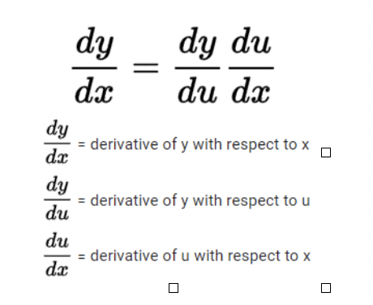
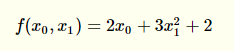
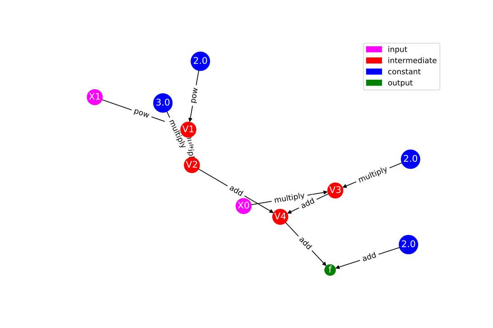
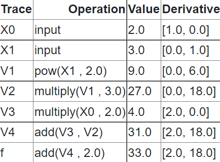
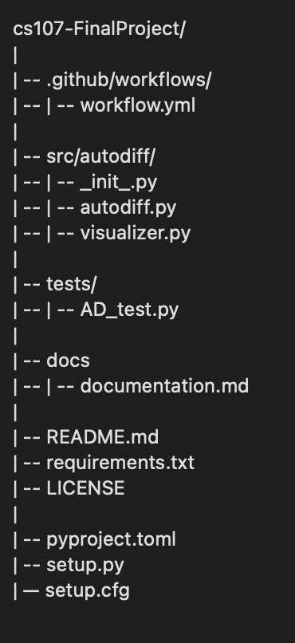

# Milestone 1
### AC207 Fall 2021

#### David Berthiaume
#### Lily Qian
#### Maggie Wu
#### Angel Hsu

## Introduction


Automatic differentiation, also known as algorithmic differentiation, involves efficiently and accurately evaluating derivatives of numeric functions from a computational perspective. In an era of rapidly advancing technology, automatic differentiation has many broad applications, especially in artificial intelligence, allowing many computations to be performed efficiently and greatly expanding the scope and coverage of artificial intelligence to widely different applications to enhance human lives. While artificial intelligence is certainly a widely known application of automatic differentiation with immense potential for further expanded applications, the significance of automatic differentiation also derives from its potential applications in computational fluid dynamics, atmospheric sciences, and engineering design and optimization.

Root finding is an algorithm used to find the zeroes or roots of a continuous function.  Often, solving for the roots of a function analytically is not possible (except in certain simple cases such as lower degree polynomials).  Iterative methods are used instead.  One highly efficient method is Newton’s method which requires exact forms or approximations of the derivative of the function.

This software package provides two libraries:
1. Autodiff provides an easy-to-use library that performs automatic differentiation of a user supplied function.
2. Rootfinder uses autodiff to find the roots for continuous functions using Newton's method.

## Background

As opposed to other methods for computing derivatives in computer programs, such as manually calculating derivatives (and then hard-coding them), numerical differentiation (finite difference approximations), symbolic differentiation (expression manipulation in computer algebra systems), automatic differentiation presents an elegant solution to allow for accurate, efficient differentiation even when involving complex operations, which the aforementioned methods tend to handle less well.

To provide a brief mathematical background, automatic differentiation involves utilizing the chain rule repeatedly. This allows us to compute the derivative of a composite function. The specification of which is included below[1]:



Rather than producing an expression for a derivative, automatic differentiation obtains its numerical value and bypasses symbolic inefficiencies by leveraging intermediate variables present in the original function implementation.

There are two main versions of automatic differentiation: forward mode and reverse mode. In simple terms, forward mode applies the chain rule to basic operations in a forward primal trace, obtaining a derivative trace. Conversely, reverse mode does not compute derivatives simultaneously but requires two separate phases: forward and backward. During the forward phase, all intermediate variables are evaluated, and their values are stored in memory. Afterwards, during the backward phase, the derivatives are propagated backwards using the chain rule. This is also known as backpropagation.

In this project, we will be using forward mode. Forward mode is probably best understood through a simple example.  Consider the following simple polynomial with two inputs x1, x2, and one output:

.

The computation graph for this polynomial looks like the following (this was rendered using the wonderful Auto-eD tool [2]). 



To compute the derivative with respect to x0 and x1 we follow the computation graph and compute the intermediate derivatives along the way using the chain rule mentioned above.  The following table show how the derivates with respect to x0 and x1 evaluated at x0 = 2 and x1 = 3 are computed.



In the 'Derivative' column, we are computing the derivative of the elementary operation in the 'Operation' column and then evaluating it at the given numeric values.  By repeating this along the computation graph, we end up with our final derivatives.  Our library for this project will be using the same approach.

## How to Use Autodiff

A user will interact with the automatic differentiation functionality through the autodiff module.  This module uses automatic differentiation to calculate the Jacobian of a user supplied function. 

To install the package you can use git clone:

```
git clone https://github.com/cs107-theteapeople/cs107-FinalProject.git 
```
If allowed and supported for this project, we will also use PyPi to allow a user to install the library with pip. (We don't want to put something on PyPi that may not be suitable.)

The general structure of usage will be as follows:

* A user will define a function by combining variables, constants, and primitive functions through various operations.  
* A user will instantiate an AutoDiff object with the supplied function.
* The differentiate member function of the AutoDiff object will then be used to calculate the desired derivatives for specific input points.

It is important to note that the details of our implementation and usage patterns may change as we progress further into the project.

Here is an example basic usage for the autodiff module.

```
import autodiff as ad
```
Set user-defined function:
```
func = 0.3 * ad.sin( ad.var('x') * ad.var('y') )
```

For higher dimensional functions where named variables will become unwieldy, we will supply methods to allow a user to conveniently create and supply arrays of input variables.
  
Instantiate the AutoDiff object:
```
ad1 = ad.AutoDiff(func)
```
Evaluate the derivative:
```
ad1.differentiate(x = 2, y = 3)
```

This will return the derivative of this function with respect to x and with respect to y evaluated at the given points as a numpy array or scalar value.  We will also provide options to allow users to specify arrays of input values by providing numpy arrays as inputs.


## How to Use Rootfinder

The rootfinder module can be used to find the roots of a supplied function defined through the autodiff module.  

Example use case:

```
import autodiff as ad
import rootfinder as rf
```

Create our function:
```
func = ad.sin( ad.var(x) ) * ad.cos(1.2) - 2.0
```

Find the roots of our function:
```
rf.findroots(func)
```

This will return the roots of the supplied function using Newton’s method as a numpy array or scalar value.

## Software Organization
#### Summary

For our code structure, we considered following the recommendations from the blog post by Jp Calderone[3] to structure a python project.  He recommends not using a ‘src’ directory, and placing tests within each module along with an appropriate __init__.py file.  This structure is useful if we have a direct relation between tests and application modules and want to distribute them along with your application.  However, in class, it was suggested to not place our tests within our source modules.  For this project, we will follow the structure outlined in class.

Our project directory structure will be of the following form:  



#### What modules do you plan on including? What is their basic functionality?

We will include two modules.  

The first module, autodiff, will contain the functionality to perform automated differentiation.  

The second module, rootfinder, is an application that uses autodiff to find the roots of a function using Newton’s method.  Here being able to find the derivative of a function with autodiff is needed to use Newton’s method, so rootfinder directly depends on autodiff.

#### Where will our test suite live?

Per the recommendations from class, our test suites (using pytest) will live within a tests directory, inside autodiff and rootfinder subdirectories.  We will be using pytest along with travis ci and codecov to monitor our test statuses and codecov to monitor our test coverage.

#### How will you distribute your package (e.g. PyPI)?
Since this project only consists of python sources and doesn't need any files to be built, installation could be done by simply cloning the repository as described above.  We encourage users to play around with the code and even submit pull requests.  Our focus will be on code readability and learning, and we hope to make the code as understandable as possible so that users will be encouraged to modify the code and try new techniques.  As mentioned above, if appropriate, we will host our project on PyPI and allow users to install the software with pip.  

#### How will you package your software? Will you use a framework? If so, which one and why? If not, why not?

Our project will only consist of python sources and a few common dependencies.  We will have no compiler requirements or binary files.  Our initial plan is to not use any packaging framework.  We will be providing a requirements.txt file to allow a user to install the needed library requirements.  We will provide clear documentation on how to install these requirements.

#### Other considerations?

Since we will be developing an application for our extension, we will speak with the teaching staff about our proposed structure. Our initial structure will have autodiff and rootfinder as two separate modules within the same repository root directory.  


## Implementation 
### Module methods

A critical component of the **autodiff** module is the ability to define functions and input variables.  We use a model similar to sympy.  As mentioned in the ‘how to use autodiff’ section of this document, elementary functions will be defined in the autodiff module and these can be combined to make composite functions.  We make heavy use of operator overloading to allow users to conveniently define their functions.  Elementary functions will be Python functions within the autodiff module that generate simple Function instances which are described below.

### Function class

Our main class for building composite functions will be the Function class.  This will use operator overloading heavily to allow the user to build up composite functions.  The forward computation graph will be generated as the composite function is built (taking advantage of the Python parser and order of operations).  The utility function ad.var(<name>) is used to build a primitive function that is just a single input variable.  These variables have names associated with them.  Composite functions are built by combining these variables with operators and primitive functions (created using helper functions in the autodiff module).  We will likely be using python dictionaries to store the computation graph as a series of nodes and their children along with their operations.  

Here are some example ways for a user to define a composite function (an instance of the Function class, or a list of instances).  

```
import autodiff as ad
x1 = ad.var(‘x1’)
x2 = ad.var(‘x2’)
func1 = x1 + x2
func2 = ad.cos( x1 * x2 ) 
func3 = ad.sin( x1 ) + ad.cos( x2 ) * 4.0 
func4 = x1 ** 6  (operator overloading allows us to handle raising powers to reals or integers)
func5 = [x1 * x2, x1 + x2] (functions with multiple outputs can be defined through lists)
```

### AutoDiff class

Once functions are defined, an AutoDiff object can be instantiated to evaluate the function for various inputs and compute the derivatives.  

```
adiff = ad.AutoDiff( func2 )
```
where func2 is an autodiff function or a list of autodiff functions (for functions that have multiple outputs).  This class automatically determines the inputs and the number of outputs from the function definition.  This is used for validation when a user requests the derivatives to be computed.  

Once this object is instantiated, the function's computation graph is traversed and the derivative is calculated.  During graph traversal we compute the necessary traces similar to how we have done this in class and store these traces in python lists.  We will not be using dual numbers for our implementation.

For this project, a core data structure that we will use is dictionaries both the store our variables (with our keys being the names of the variables) and to store our computation graph.  Even though dictionaries are not the most efficient way to store this data, we would like to focus on software design, code readability, maintainability, and learning over efficiency for this project (see our mission statement below).  

This class provides one key method to calculate derivatives.  

```
adiff.differentiate( x1 = 4.0, x2 = 2.0 )
```

Inputs are entered as keyword arguments or a dictionary.  We match these inputs with the expected variables from the function that was used when instantiating the object.  If there is a mismatch in variables and expected inputs, we raise an appropriate error.  For array inputs, we will check to make sure the array sizes match the expected inputs as defined in the function.

Once this function is called, the computation graph (created during function object instantiation) is used to evaluate the function at the supplied points, and then compute the derivative at these points using forward mode automatic differentiation.  We do not plan to use dual numbers for this project as we feel that doing so will potentially reduce code readability and understanding.  As we perform the forward and tangent traces, we will be storing these intermediate results in simple Python lists.

For functions with multiple inputs and/or outputs, we will allow users to specify which derivatives they would like to compute.  By default, we will compute all derivatives and return the Jacobian.  

### External Dependencies

We would borrow from external dependencies such as numpy and potentially a graph plotting library for viewing the computation graphs. For efficient computation, we will be relying heavily on numpy to carry out the elementary function operations within each defined elementary function in autodiff; for example, for the primal trace and its corresponding tangent trace for ad.sin(), we would use np.sin() and np.cos() to carry out the operations respectively.  For efficiency, we may consider using the [numba](https://numba.pydata.org/) library as an optional dependency for some of our core algorithms if this doesn’t reduce code readability and understanding.  We are also considering storing a map of primitive functions and their corresponding derivatives in a separate text file rather than hard-coding them.

## License:

After much consideration, we have settled on using the gnu GPLv3 license as it has allows one to do almost anything they want with the code **except** distributing closed-source versions.  Given the academic nature of this project, we feel it is best that close-source versions are not allowed.  The main purpose of this code is for people to learn from it, and we feel that having the freedom to view and modify code is a critical part of this.  

## Mission Statement:
Our goal with this project is to provide an automatic differentiation and rootfinder library that is easy to understand, read, and modify.  We wish to provide potential users with an easy-to-understand code that they can learn from.  We encourage users to modify the code and experiment with various techniques.

## References:

1. Lange, R. (2019, September 2). Forward mode automatic differentiation &amp; dual numbers. Medium. Retrieved October 20, 2021, from https://towardsdatascience.com/forward-mode-automatic-differentiation-dual-numbers-8f47351064bf. 

2. Lindsey Brown, Rachel Moon, and David Sondak IACS Harvard, https://autoed.herokuapp.com/

3. Jp Calderone, 16:58:00, 2007-12-21, Filesystem structure of a python project. jcalderone. Retrieved October 20, 2021, from https://jcalderone.livejournal.com/39794.html. 

4. Good Integration Practices - pytest documentation. (n.d.). Retrieved October 20, 2021, from https://docs.pytest.org/en/6.2.x/goodpractices.html. 
