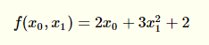
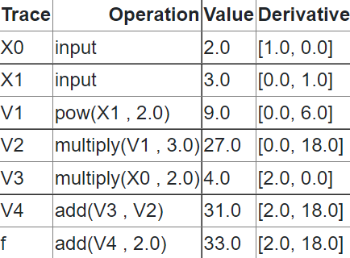

# Milestone 2
### AC 207 Fall 2021   

#### David Berthiaume
#### Lily Qian
#### Maggie Wu
#### Angel Hsu

## Introduction

Automatic differentiation, also known as algorithmic differentiation, involves efficiently and accurately evaluating derivatives of numeric functions from a computational perspective. In an era of rapidly advancing technology, automatic differentiation has many broad applications, especially in artificial intelligence, allowing many computations to be performed efficiently and greatly expanding the scope and coverage of artificial intelligence to widely different applications to enhance human lives. While artificial intelligence is certainly a widely known application of automatic differentiation with immense potential for further expanded applications, the significance of automatic differentiation also derives from its potential applications in computational fluid dynamics, atmospheric sciences, and engineering design and optimization.

Root finding is an algorithm used to find the zeroes or roots of a continuous function.  Often, solving for the roots of a function analytically is not possible (except in certain simple cases such as lower degree polynomials).  Iterative methods are used instead.  One highly efficient method is Newton’s method which requires exact forms or approximations of the derivative of the function.

This software package provides two libraries:
1. Autodiff provides an easy-to-use library that performs automatic differentiation of a user supplied function.
2. Rootfinder uses autodiff to find the roots for continuous functions using Newton's method.

## Background

As opposed to other methods for computing derivatives in computer programs, such as manually calculating derivatives (and then hard-coding them), numerical differentiation (finite difference approximations), symbolic differentiation (expression manipulation in computer algebra systems), automatic differentiation presents an elegant solution to allow for accurate, efficient differentiation even when involving complex operations, which the aforementioned methods tend to handle less well.

To provide a brief mathematical background, automatic differentiation involves utilizing the chain rule repeatedly. This allows us to compute the derivative of a composite function. The specification of which is included below[1]:


Rather than producing an expression for a derivative, automatic differentiation obtains its numerical value and bypasses symbolic inefficiencies by leveraging intermediate variables present in the original function implementation.

There are two main versions of automatic differentiation: forward mode and reverse mode. In simple terms, forward mode applies the chain rule to basic operations in a forward primal trace, obtaining a derivative trace. Conversely, reverse mode does not compute derivatives simultaneously but requires two separate phases: forward and backward. During the forward phase, all intermediate variables are evaluated, and their values are stored in memory. Afterwards, during the backward phase, the derivatives are propagated backwards using the chain rule. This is also known as backpropagation.

In this project, we will be using forward mode. Forward mode is probably best understood through a simple example.  Consider the following simple polynomial with two inputs x1, x2, and one output:

.

The computation graph for this polynomial looks like the following (this was rendered using the wonderful Auto-eD tool [2]). 


To compute the derivative with respect to x0 and x1 we follow the computation graph and compute the intermediate derivatives along the way using the chain rule mentioned above.  The following table show how the derivates with respect to x0 and x1 evaluated at x0 = 2 and x1 = 3 are computed.



In the 'Derivative' column, we are computing the derivative of the elementary operation in the 'Operation' column and then evaluating it at the given numeric values.  By repeating this along the computation graph, we end up with our final derivatives.  Our library for this project will be using the same approach.

## How to Use Autodiff

A user will interact with the automatic differentiation functionality through the autodiff module. This module uses automatic differentiation to calculate the Jacobian of a user supplied function. 

### Installation

We have not published the autodiff package on PyPI yet. Hence, to install the package, you can use git clone:

`git clone https://github.com/cs107-theteapeople/cs107-FinalProject`

Once you have cloned the code, navigate to the root directory of the repository.  In the above example, this would be `cs107-FinalProject`.  

The only requirement for our project is numpy.  This can be installed with pip using the supplied requirements.txt file
with the following command.

`pip install -r requirements.txt`

### Usage

In the root directory of the repository, you can import the main autodiff module with the following code: 

`from autodiff import autodiff as ad`

The general structure of usage will be as follows:
1. A user will instantiate a scalar variable using the autodiff module 
2. A user will define a function by combining variables, constants, and primitive functions through various operations using the autodiff module.  
3. Function value and derivatives will be calculated and returned for specific input points using the `eval` function.  
 
Here is an example of basic usage for the autodiff module. 

Instantiate a scalar variable:
`x = ad.var(‘x’)`

Set a user-defined composite function:

`f = ad.exp(ad.sin(x + 3 * x**2) * ad.cos(x))`

Evaluate the function and derivative at multiple points:
```
import numpy as np
for i in np.linspace(1,3,10):
    print(f.eval(x=i))
```

This will return both the value and the derivative of this function with respect to x evaluated at the given points as a numpy array or scalar value within a dictionary.  For example:
`{'value': -3.027209981231713, 'derivative': -3.3713769787623757}`

## How to Use Rootfinder

The rootfinder module can be used to find the roots of a supplied function defined through the autodiff module. The module allows the user to set the precision level as well as the maximum iterations allowed for the rootfinder to solve for the input function's root.  

Example use case:

```
from autodiff import autodiff as ad
from autodiff import rootfinder as rf
```

Create our function:
```
func = ad.sin( ad.var('x') ) * ad.cos(1.2) - 2.0
```

Find the roots of our function:
```
rf.findroots(func, precision_level = 0.001, max_iterations = 2000)
```

This will return the roots of the supplied function using Newton’s method as a numpy array or scalar value.

## Software Organization
#### Summary

For our code structure, we considered following the recommendations from the blog post by Jp Calderone[3] to structure a python project.  He recommends not using a ‘src’ directory, and placing tests within each module along with an appropriate __init__.py file.  This structure is useful if we have a direct relation between tests and application modules and want to distribute them along with your application.  However, in class, it was suggested to not place our tests within our source modules.  For this project, we will follow the structure outlined in class.

Our project directory structure will be of the following form:  


#### What modules do you plan on including? What is their basic functionality?

We will include two modules.  

The first module, autodiff, will contain the functionality to perform automated differentiation.  

The second module, rootfinder, is an application that uses autodiff to find the roots of a function using Newton’s method.  Here being able to find the derivative of a function with autodiff is needed to use Newton’s method, so rootfinder directly depends on autodiff.

#### Where do our test suite live?

Per the recommendations from class, our test suites (using pytest) live within a tests directory. We use pytest for our testing and codecov to monitor our code coverage.  Since Travis CI is no longer free, we set up a workflow to update codecov automatically via Github Action  instead of going through Travis CI.

#### How will you distribute your package (e.g. PyPI)?
Since this project only consists of python sources and doesn't need any files to be built, installation could be done by simply cloning the repository as described above.  We encourage users to play around with the code and even submit pull requests.  Our focus will be on code readability and learning, and we hope to make the code as understandable as possible so that users will be encouraged to modify the code and try new techniques.  As mentioned above, if appropriate, we will host our project on PyPI and allow users to install the software with pip.  

#### How will you package your software? Will you use a framework? If so, which one and why? If not, why not?

Our project will only consist of python sources and a few common dependencies.  We will have no compiler requirements or binary files. For milestone 2, our initial plan is to not use any packaging framework.  We will be providing a requirements.txt file to allow a user to install the needed library requirements.  We will provide clear documentation on how to use autodiff and install these requirements.

#### Other considerations?

Since we will be developing an application for our extension, we will speak with the teaching staff about our proposed structure. Our initial structure will have autodiff and rootfinder as two separate modules within the same repository root directory.  


## Implementation 
### Introduction

A critical component of the **autodiff** module is the ability to define functions and input variables.  We use a model similar to sympy.  As mentioned in the ‘how to use autodiff’ section of this document, elementary functions will be defined in the autodiff module and these can be combined to make composite functions.  We make heavy use of operator overloading to allow users to conveniently define their composite functions.  Elementary functions will be Python functions within the autodiff module that generate simple intermediate node instances as described below.  

Our autodiff library uses lazy evaluation.  The binary tree of nodes is built first and possible values are represented by variable nodes.  Once a binary tree is created when the function is defined, the tree can be traversed and the value of the function and the derivative of the function computed by using the `eval` function as described in the *how to use* section.  In this way, a single function can be defined, and then efficiently evaluated at any number of inputs.  In particular, this approach will be useful for our Newton solver.

### Node class

Our main class for building composite functions is the autodiff node class.  There are three types of nodes.  

1. A variable node - this node contains a symbolic representation of a numeric value.   It is a leaf node in the binary tree corresponding to a composite function.
2. A constant node - this node contains a specific numeric value that does not change.  Just like the variable node, it is a leaf node in our binary tree.
3. An intermediate node - these are all non-leaf nodes and have unary or binary functions attached to them.  These intermediate nodes are traversed during forward computation, the functions are applied and the derivatives are computed using the chain rule.  

Nodes will use operator overloading heavily to allow the user to build up composite functions.  The forward computation graph will be generated as the composite function is built (taking advantage of the Python parser and order of operations).  The utility function `var(<name>)`, is used to build a single variable node.  These variables nodes have names associated with them.  Composite functions are built by combining these variables with operators and primitive functions (created using helper closures in the autodiff module), and constants. 

Here are some example ways for a user to define a composite function (an instance of the Node class with children, or a list of instances).  

```
from autodiff import autodiff as ad
x1 = ad.var(‘x1’)
x2 = ad.var(‘x2’)
func1 = x1 + x2
func2 = ad.cos( x1 * x2 ) 
func3 = ad.sin( x1 ) + ad.cos( x2 ) * 4.0 
func4 = x1 ** 6  (operator overloading allows us to handle raising powers to reals or integers)
func5 = [x1 * x2, x1 + x2] (functions with multiple outputs can be defined through lists)
func6 = x1 ** (cos(x1) + 2 * x1) + 42
```

### Evaluation

Once a composite function is defined, the `eval` function can be called to evaluate the function and compute the derivative of the function at the specified inputs efficiently.

Inputs are entered as keyword arguments or a dictionary.  We match these inputs with the expected variables from the composite function corresponding to the Node.  If there is a mismatch in variables and expected inputs, we raise an appropriate error.  For array inputs, we will check to make sure the array sizes match the expected inputs as defined in the function.  Only numeric inputs are allowed.

Once this function is called, the computation graph (created during function object instantiation) is used to evaluate the function at the supplied points, and then compute the derivative at these points using forward mode automatic differentiation.  As we perform the forward and tangent traces, we store these intermediate results within all the nodes of the binary tree.

For functions with multiple inputs and/or outputs, we will allow users to specify which derivatives they would like to compute.  By default, we will compute all derivatives and return the Jacobian.  

### Adding New Functions

We have written a closure `get_function` that allows one to very easily add functions to our autodiff library.  This closure returns a function that handles inserting the necessary nodes into the binary tree, defining the right types of node to insert, establishing the appropriate child nodes, and storing the primary and tangent functions.  

The following is an example of using this closure to create the *tan* function.

```
tan = get_function(np.tan,   lambda x,xp : xp * (1/np.cos(x))**2)
```

This closure takes two arguments.  The first one defines the function to evaluate and the second one defines the derivative of that function (using the chain rule).  In this example, the function 
`lambda x,xp : xp * (1/np.cos(x))**2` is inlined as a lambda function, but this could also easily have been a regular python function.  

Our primary function expects one or two arguments corresponding to the values of the inputs depending on if the function is unary (sin, cos, etc.) `x`, or binary (addition, multiplication, division, etc.) `x` and `y`.  The derivative function expects 4 arguments. These are the values of the inputs `x`, and `y` and the derivatives of the inputs `xp`, and `yp`

### External Dependencies

We would borrow from external dependencies such as numpy and potentially a graph plotting library for viewing the computation graphs. For efficient computation, we will be relying heavily on numpy to carry out the elementary function operations within each defined elementary function in autodiff; for example, for the primal trace and its corresponding tangent trace for ad.sin(), we would use np.sin() and np.cos() to carry out the operations respectively.  For efficiency, we may later consider using the [numba](https://numba.pydata.org/) library as an optional dependency for some of our core algorithms if this doesn’t reduce code readability and understanding.  

## License:

After much consideration, we have settled on using the gnu GPLv3 license as it has allows one to do almost anything they want with the code **except** distributing closed-source versions.  Given the academic nature of this project, we feel it is best that close-source versions are not allowed.  The main purpose of this code is for people to learn from it, and we feel that having the freedom to view and modify code is a critical part of this.  

## Future Features

There several future features on our list which we will be implementing and a few more difficult features that we are considering to implement.

1. Support for multiple input variables - Currently only scalar functions are supported.  Right after milestone2 and ensuring that we have thoroughly tested our code for scalar functions, we will add support for multiple inputs.  Given the modular design of our software, we feel that this will not be difficult to implement.  During traversal, we will need to keep track of all of our input variables and their corresponding derivatives.  


2. Support for multiple output values - Currently we only support functions with scalar outputs.  After we have implemented vector inputs, we will add support for vector outputs.  Given our graph construction, this should be fairly straight forward.  We will be returning all of these values as a dictionary from the `eval` function.  


3. Support for arrays of variables.  Even with vector functions supported, variables will need to be defined individually, i.e.
`x1, x2, x3 = var('x1'), var('x2'), var('x3')...`
This is quite cumbersome.  We plan on adding support for vectors of variables in the following manner.
`x_array = var_array('x', 100)` which will generate an array of 99 variables. These can be referenced by using indices, `x[4]` to reference the 4th variable.
Some applications of this include defining recursive functions, and working with finite series.  


4. We will be implementing a root finding algorithm using Newton's method.  A function can be defined using the autodiff library, and then newton's method will solve for the roots of the given function.  This will be iteratively using autodiff to efficiently compute derivatives.  The lazy evaluation approach of our library lends itself quite well to a Newton solver, where the same equation (and its derivative) is evaluated over and over again.


5. An option we are considering, since we would like to provide this library for educational purposes, is to generate a nice printout or graph of the binary tree and the primary and tangent traces as they are being evaluated.  Since we store all of this information in the binary tree, it would be useful to be able to see the inner workings of automatic differentiation as it is being applied.  We have already supplied several simple preorder and postorder print methods for our binary tree.  We would be expanding on this functionality.


6. Similar to 5, we may consider implementing a simple visualization tool to plot (using matplotlib) the iterations as an animation or static plot of our newton solver for scalar functions.  For example, since we use a lazy evaluation approach to automatic differentiation, it is easy to plot a given function along a range of input points.  It is easy to iterative compute and plot the derivatives as well as the individual steps that the Newton solver takes to find the nearest root of the composite function.
 

## Mission Statement:
Our goal with this project is to provide an automatic differentiation and rootfinder library that is easy to understand, read, and modify.  We wish to provide potential users with an easy-to-understand code that they can learn from.  We encourage users to modify the code and experiment with various techniques.

## References:

1. Lange, R. (2019, September 2). Forward mode automatic differentiation &amp; dual numbers. Medium. Retrieved October 20, 2021, from https://towardsdatascience.com/forward-mode-automatic-differentiation-dual-numbers-8f47351064bf. 

2. Lindsey Brown, Rachel Moon, and David Sondak IACS Harvard, https://autoed.herokuapp.com/

3. Jp Calderone, 16:58:00, 2007-12-21, Filesystem structure of a python project. jcalderone. Retrieved October 20, 2021, from https://jcalderone.livejournal.com/39794.html. 

4. Good Integration Practices - pytest documentation. (n.d.). Retrieved October 20, 2021, from https://docs.pytest.org/en/6.2.x/goodpractices.html. 

## Feedback

### Milestone 1

Introduction: great Introduction, I like the way you bring AD. 
Background: I really love your Background, I understand what is at stake and how you are going to leverage the differentiation properties in order to simplify the differentiation of big and cool functions.  
How to use: Very clear, I like the way you thought through such detailed use cases in order to apprehend everything. 
Implementation: very detailed outline of your implementation, I think this will be a good backbone for your actual project implementation.
